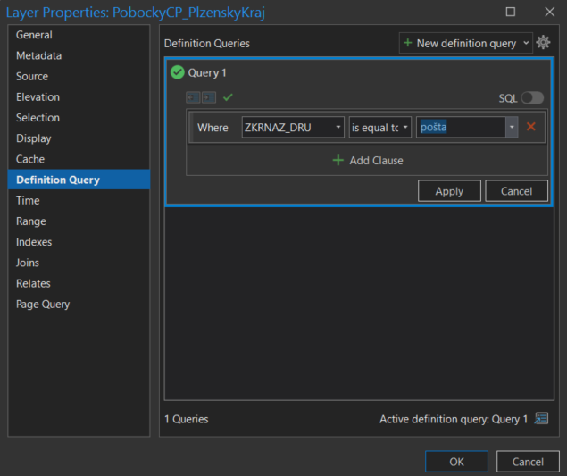
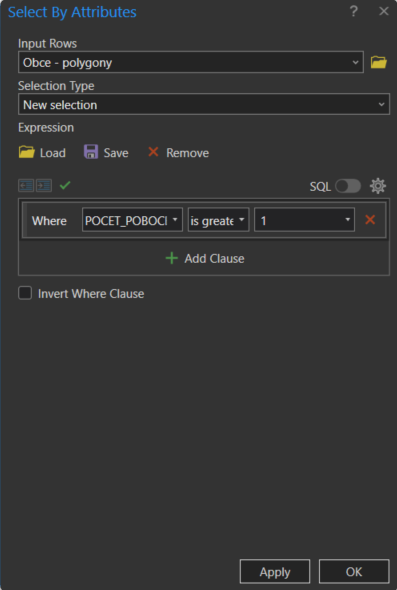
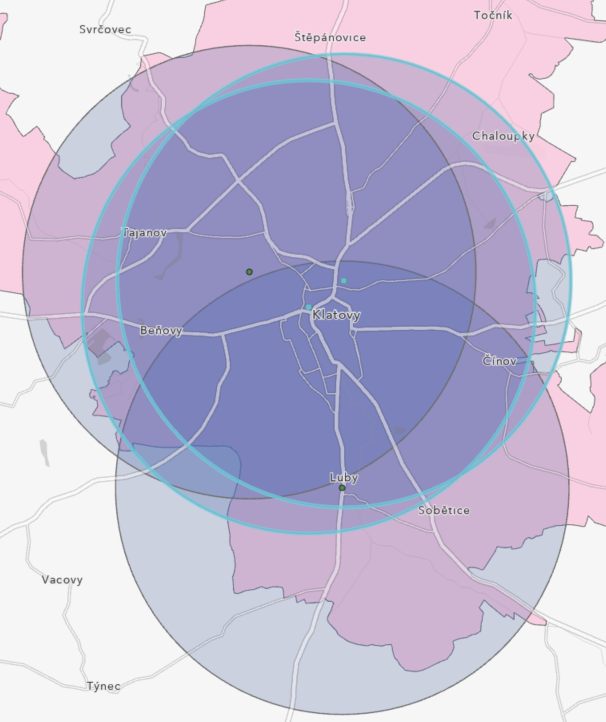

# Prostorové (překryvné) funkce. Geoprocessingové nástroje (tools)

## Cíl bloku

Seznámení se se základními geoprocessingovými nástroji v GIS v rámci řešení komplexnější úlohy. Tyto nástroje nalezneme v panelu *Analysis > Tools* a zůstávají otevřené jako panel *Tools* v pravé části okna.

**Prostorové (překryvné) funkce** slouží k analýze a kombinaci prostorových dat z různých zdrojů. Umožňují zjišťovat vztahy mezi geografickými objekty a odvozovat z nich nové informace. Tyto funkce pracují s geometrickou složkou dat (body, linie, polygony) a umožňují provádět operace jako průnik, sjednocení, rozdíl nebo ořez geometrických objektů. Výsledkem těchto operací jsou nové prvky s atributy odvozenými z původních datových vrstev. Díky tomu můžeme efektivně analyzovat prostorové vztahy a získávat komplexnější pohled na studované území.

Charakteristickým rysem těchto nástrojů je práce s prostorovými vztahy mezi objekty. Nejde jen o vizuální překrytí, ale o matematické operace s geometrií objektů. Důležité však je, že pracují také s atributy objektů. Výsledné prvky tak mohou mít atributy odvozené z obou vstupních vrstev, což umožňuje komplexní analýzy a vyhodnocování dat. 

## Základní pojmy

- [**buffer**](https://pro.arcgis.com/en/pro-app/latest/tool-reference/analysis/buffer.htm)
- [**clip**](https://pro.arcgis.com/en/pro-app/latest/tool-reference/analysis/clip.htm)
- [**intersect**](https://pro.arcgis.com/en/pro-app/latest/tool-reference/analysis/intersect.htm)
<!-- - [**select**](https://pro.arcgis.com/en/pro-app/latest/tool-reference/analysis/select.htm) -->
<!-- - [**spatial join**](https://pro.arcgis.com/en/pro-app/latest/tool-reference/analysis/spatial-join.htm) -->
- [**erase**](https://pro.arcgis.com/en/pro-app/latest/tool-reference/analysis/erase.htm)
- [**union**](https://pro.arcgis.com/en/pro-app/latest/tool-reference/analysis/union.htm)
<!-- - [**remove overlap**](https://pro.arcgis.com/en/pro-app/latest/tool-reference/analysis/remove-overlap-multiple.htm)
- [**symmetrical difference**](https://pro.arcgis.com/en/pro-app/latest/tool-reference/analysis/symmetrical-difference.htm)
- [**count overlapping features**](https://pro.arcgis.com/en/pro-app/latest/tool-reference/analysis/count-overlapping-features.htm)-->

### BUFFER

Slouží k vytvoření zóny, která představuje maximální definovanou vzdálenost od prvku. Výsledkem je nová vrstva obsahující plochy, které obklopují původní objekty. 

Příkladem může být:

- **území do 1 km od hranice města**;
- **plocha v pohraničí do 20 km od státní hranice**;
- **ochranné pásmo do 50 m od vedení vysokého napětí** apod.

<figure markdown>
  
  <figcaption>Parametry nástroje BUFFER pro tvorbu obalové zóny (vzdálenost 3 km)</figcaption>
</figure>

<figure markdown>
  
  <figcaption>Možnosti nástroje BUFFER s ohledem na geometrický typ a typ sloučení výsledků</figcaption>
</figure>

### CLIP

Slouží k ořezu vstupní vrstvy cílovou vrstvou. Výsledkem je nová vrstva obsahující pouze ty části vstupních objektů, které leží uvnitř ořezové vrstvy. Slouží k extrahování dat z určité oblasti zájmu.

Příkladem může být:

- **území chráněné krajinné oblasti, které je vodní plochou**;
- **část toku řeky, která protéká určitým krajem**;
- **podíl ochranného pásma, které leží v lese** apod.

<figure markdown>
  
  <figcaption>Příklad nástroje Clip pro vstupní vrstvu linií a ořezovou vrstvu plochy</figcaption>
</figure>

<figure markdown>
  
  <figcaption>Příklad oříznutí vrstvy poboček aktivními prvky ve vrstvě obcí</figcaption>
</figure>

### INTERSECT

Je obecnější variantou funkce *Clip* a slouží k vytvoření obecného průniku dvou nebo více vrstev. Výsledkem je nová vrstva obsahující pouze ty části objektů, které se překrývají ve všech vstupních vrstvách a dle charakteru vstupních vrstev mohou výsledkem být body, linie nebo plochy. *Intersect* se používá se k identifikaci oblastí, kde se shodují různé prostorové jevy.

Příkladem může být:

- **křížení silnice s vodním tokem**;
- **část toku řeky, která protéká určitým krajem**;
- **prodejny, které leží v určitém okrese** apod.

### ERASE

Slouží k vyříznutí plochy, představované cílovou vrstvou, ze vstupní vrstvy. Výsledkem je nová vrstva obsahující pouze ty části vstupních objektů, které *neleží* uvnitř vymazávací vrstvy. Hodí se pro odstranění nežádoucích oblastí z dat.

Příkladem může být:

- **odečtení vodních ploch z plochy obce**;
- **zjištění plochy území ležící mimo ochranné pásmo**;
- **zbytková plocha okresu po odečtení 10km pásma podél jeho hranice** apod.

### UNION

Funkce sloučí dvě nebo více vstupních vrstev do jedné. Výsledkem je nová vrstva obsahující všechny objekty z obou (či více) vstupních vrstev, včetně překrývajících se částí. Vytvoří se tak kompletní pokrytí všech oblastí zúčastněných vrstev.

Příkladem může být:

- **souhrnná vrstva železničních stanic i autobusových zastávek**;
- **sloučení ploch obcí do plochy mikroregionu** apod.

Následující přehled ukazuje nejpoužívanější nástroje prostorových funkcí v ArcGIS Pro.

<figure markdown>
  
  <figcaption>Srovnání vstupních vrstev a výsledků operace pro různé nástroje prostorových funkcí</figcaption>
</figure>

<!--

## Použité datové podklady

- [Pobočky](../assets/cviceni3/PobockyCP_PlzenskyKraj.zip) České pošty v Plzeňském kraji (bodová vrstva)
- Obce ČR ([ArcČR 500](../../data/#arccr-500), polygonová vrstva)

## Náplň cvičení

Představte si, že pracujete jako GIS analytik pro Českou poštu a vaším úkolem je z důvodu úspor navrhnout řešení snížení počtu poboček. Snahou tohoto kroku je však i minimalizace negativních dopadů na obyvatele, proto bylo rozhodnuto o následujících podmínkách, které musíte ve svém návrhu dodržet:

1. Rušení poboček nebude probíhat v obcích s méně než 2500 obyvateli.
2. V obcích nad 2500 obyvatel neklesne počet poboček pod 1.
3. Vzájemná vzdálenost poboček v jedné obci nebude nižší než 3 km vzdušnou čarou.

Jakou finanční úsporu jste schopni svým návrhem zajistit, pokud by provoz jedné pobočky vycházel ročně na 2,5 milionu CZK? Pro zjednodušení budete úlohu řešit pouze v rámci Plzeňského kraje a ke každé pobočce přistupovat rovnocenně.

## Pracovní postup

**1.** Výběr obcí v Plzeňském kraji s více než 2500 obyvateli (atributový dotaz) a tvorba samostatné vrstvy selektovaných prvků.

<figure markdown>
  
  <figcaption>Atributový dotaz na vrstvu obcí</figcaption>
</figure>

**2.** Výběr typu pobočky zavedením *Definition Query* (výraz: ZKRNAZ_DRU = 'pošta').

<figure markdown>
  
  <figcaption>Definition Query pro vrstvu poboček pošty</figcaption>
</figure>

<figure markdown>
  
  <figcaption>Vizualizace stavu nad podkladovou mapou</figcaption>
</figure>

**3.** Spatial join: k výběru obcí připojíme pobočky na základě jejich polohy. Zároveň přidáme nový atribut POCET_POBOCEK, který bude určen na základě sumy libovolného ze stávajících atributů vrstvy poboček (např. count(GmIID)).

<figure markdown>
  
  <figcaption>Spatial join</figcaption>
</figure>

**4**. Následně zadáme atributový dotaz na vrstvu obcí, který vybere prvky s více než 1 pobočkou (POCET_POBOCEK *is greater than* 1).

<figure markdown>
  
  <figcaption>Atributový dotaz na vrstvu obcí</figcaption>
</figure>

**5**. V dalším kroku použijeme nástroj *CLIP* a vytvoříme novou vrstvu obsahující takové pobočky pošty, které se nacházejí v obcích s více než 1 pobočkou. Tím, že v předchozím kroku byla provedena selekce pouze některých prvků z vrstvy obcí, do funkce *CLIP* vstoupí pouze tento aktivní výběr.

<figure markdown>
  
  <figcaption>Oříznutí vrstvy poboček aktivními prvky ve vrstvě obcí.</figcaption>
</figure>

<figure markdown>
  
  <figcaption>Vizualizace stavu po ořezu.</figcaption>
</figure>

**6**. S využitím nástroje *BUFFER* vytvoříme obalovou zónu kolem každé pobočky o poloměru 3 km.

<figure markdown>
  
  <figcaption>Parametry nástroje BUFFER pro tvorbu obalové zóny (rádius 3 km)</figcaption>
</figure>

**7**. Nyní přistoupíme k vizuálnímu vyhodnocení poboček vhodných ke zrušení. Např. v Klatovech lze při dodržení zadaných kritérií zrušit právě 2 pobočky České pošty (zvýrazněné včetně svých obalových zón), resp. zachovat maximálně 2 pobočky (viz níže).

<figure markdown>
  { width="500" }
  <figcaption>Příklad poboček aspirujících na zrušení</figcaption>
</figure>

**8**. V atributové tabulce poboček vytvoříme pomocí *Add Field* pomocný atribut RUSENO (datový typ *short*, defaultní hodnota 0).

<figure markdown>
  
  <figcaption>Přidání nového pole do atributové tabulky</figcaption>
</figure>

**9**. Manuálně vybereme (pomocí *Select*) pobočky vyhovující kritériím zrušení změnou hodnoty atributu RUSENO na 1.

**10**. Nyní je možné zobrazit rušené pobočky zavedením *Definition Query* (výraz RUSENO = 1) nebo naopak pobočky splňující podmínky, aby byly zachovány (výraz RUSENO = 0).

<figure markdown>
  
  <figcaption>Pobočky pošty, kterou mohou být zachovány.</figcaption>
</figure>

**11**. Závěrem lze porovnat, jak rušení poboček České pošty v r. 2023 skutečně proběhlo; přehled naleznete např. [zde](https://www.seznamzpravy.cz/clanek/fakta-ceska-posta-zrusene-pobocky-seznam-mapa-231064). Celý problém je samozřejmě složitější, jelikož finální výběr ovlivnily další faktory jako priorita pobočky (hlavní vs. vedlejší), bezbariérovost, apod.

-->

## Typické úlohy

!!! task-fg-color "Úlohy k prostorovým funkcím"

    Následující úlohy představují typické zástupce úloh řešitelných pomocí prostorových funkcí:

    1. Jaká je výměra (v ha) bažin a rašelinišť ležících v lese. Kolik to
       je procent z celkové výměry bažin a rašelinišť?
       
    2. Jaká je výměra (v km^2^) území (omezeného pouze na ČR) do 100 m od dálnic?

    3. Kolik obcí v ČR leží celou svojí plochou do vzdálenosti 10 km od
       řeky Labe. Jaký je celkový počet obyvatel těchto obcí?

    4. Na kolika místech kříží dálnice, rychlostní silnice či silnice
       1. třídy s železnicí. Kolik z těchto křížení leží do vzdálenosti 1 km
       od nejbližší železniční stanice?

    5. Jaká je výměra území (v ha), na kterých leží les či vodní
       plocha. Existuje území, které by odpovídalo současně oběma
       podmínkám?

    6. Vytvořte společnou datovou vrstvu pro letiště a železniční
       stanice. Kolik objektů tato vrstva obsahuje?

    7. Kolik procent z celkové výměry ČR činí uzemí, která jsou vzdálená
       od nejbližšího rybníku více než 25 km?

    8. Jaká je výměra uzemí ČR (v km^2^), která leží dále než 5 km od
       nejbližší silnice a zároveň dále než 10 km od nejbližší železniční
       stanice? Na území kterých obcí leží největší z hledaných lokalit?

    9. Kolik procent území Jihočeského kraje tvoří vodní plochy?
